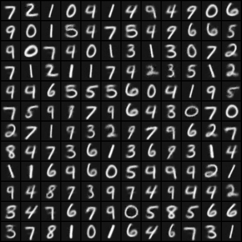
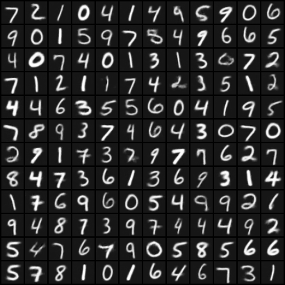
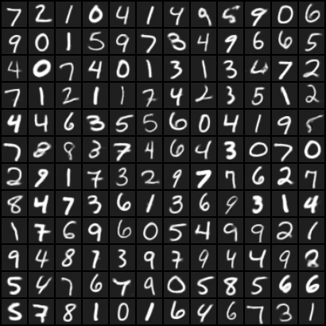
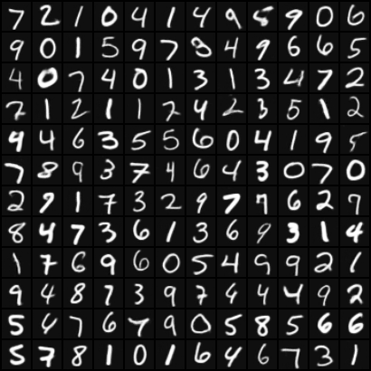
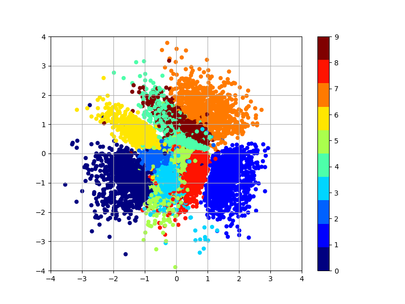

# VAE-Pytorch
Clone coding of [PyTorch-VAE](https://github.com/AntixK/PyTorch-VAE/tree/master) to study VAE

## 🚀 Train
```bash
python train.py -c configs/celeba.yaml
python train.py -c configs/mnist.yaml
```

## 📸 Reconstructions
| Original image                  | 2-D latent space             | 5-D latent space             | 10-D latent space             | 20-D latent space             |
|:-------------------------------:|:----------------------------:|:----------------------------:|:-----------------------------:|:-----------------------------:|
|  |  |  |  |  |

## 🎨 Learned MNIST manifold


## ✨ New features
- [x] Use WandB instead of TensorBoard
- [x] Can train with MNIST dataset
- [x] Add MNIST reconstruction results
- [x] Visualize of learned data manifold

## 📄 Reference
- [PyTorch-VAE](https://github.com/AntixK/PyTorch-VAE/tree/master)
- [pytorch-mnist-vae](https://github.com/dragen1860/pytorch-mnist-vae)